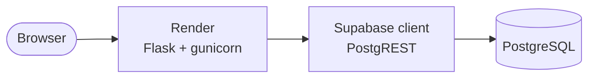
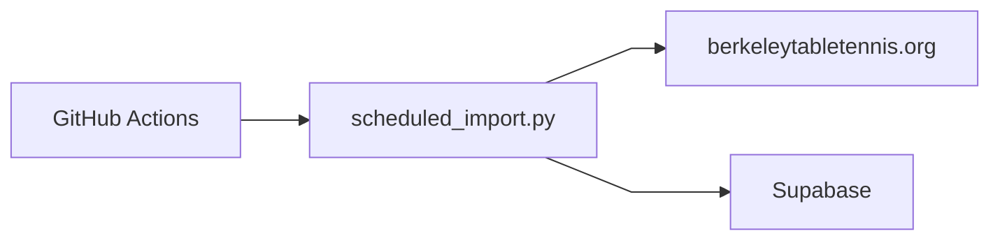
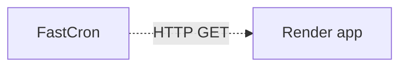
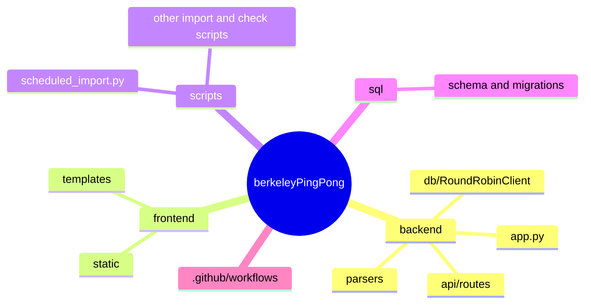

# Berkeley Ping Pong — round robin stats

Flask app + importer for Berkeley Table Tennis round robin results, backed by **Supabase**.

## Production architecture

The live stack is built around **free tiers**: a hosted Flask app on **Render**, **PostgreSQL** and APIs on **Supabase**, and a **weekly GitHub Actions** job that scrapes the club site and writes new data. An optional **FastCron** ping can reduce cold starts and help keep the Supabase project active.

Diagrams are split so each reads left-to-right (GitHub’s Mermaid renderer handles that layout more cleanly than one tall graph with many subgraphs). Use **short node labels** in the chart and put detail in the prose below.

### Web traffic (visitors → app → database)

### Weekly import (automation)

### Optional: keep the app warm / touch the DB

**How to read it:** Users hit the Render URL. The Flask app serves Jinja templates and static assets from `frontend/` and exposes JSON under the API routes in `backend/api/`. The database client uses Supabase credentials to talk to PostgreSQL. The weekly Action runs the same import pipeline as locally, but unattended, and pushes rows into Supabase.

## Repository layout

A **mindmap** keeps the folder tree readable; dependencies between app, API, DB, and scripts are described in text so the chart does not turn into spaghetti.

Imports and parsers share logic with the web tier: scripts add the repo root to `sys.path` and reuse `backend` modules. **`backend/app.py`** wires **`api/`** to **`db/`**; **`scheduled_import.py`** uses **`parsers/`** and the same DB client patterns as the web app.

## Infrastructure

### Supabase

PostgreSQL holds tournament and player data. The app uses the Supabase client (see `backend/db/round_robin_client.py`) with `SUPABASE_URL` and `SUPABASE_KEY`. Schema definitions live under `sql/`. On the **free** plan, projects can pause after long inactivity; the **weekly import** counts as activity. For more on staying active and what to ping, see **[docs/INFRASTRUCTURE.md](docs/INFRASTRUCTURE.md)**.

### API and web hosting (Render)

The Flask application is deployed as a **Render** web service (`render.yaml`: `gunicorn backend.app:app`; `Procfile` for compatible platforms). Render injects `SUPABASE_URL` and `SUPABASE_KEY`; optional `GOOGLE_ANALYTICS_ID` is available to templates. The **free** web tier **spins down** when idle, so the first request after sleep can be slow (cold start). Full deployment steps: **[docs/DEPLOYMENT.md](docs/DEPLOYMENT.md)**.

### GitHub Actions

Workflow **`.github/workflows/scheduled-import.yml`** runs **`scripts/scheduled_import.py`** on a **cron** (Saturdays **09:00 UTC**; see [INFRASTRUCTURE](docs/INFRASTRUCTURE.md) for Pacific time notes). It needs repository secrets **`SUPABASE_URL`** and **`SUPABASE_KEY`** (and any environment rules your workflow uses). Failed runs can open a GitHub issue. Setup and troubleshooting: **[docs/GITHUB_ACTIONS_SETUP.md](docs/GITHUB_ACTIONS_SETUP.md)**; import behavior: **[docs/SCHEDULED_IMPORT_GUIDE.md](docs/SCHEDULED_IMPORT_GUIDE.md)**.

### Other pieces

| Piece | Role |
|--------|------|
| **FastCron** (optional) | External HTTP scheduler to ping your Render URL (e.g. `/` or `/api/players`) so the service wakes up and Supabase sees traffic—useful if you want fewer cold starts or extra activity between weekly imports. |
| **Google Analytics** | Optional `GOOGLE_ANALYTICS_ID` on Render for template analytics. |

## Quick links

- [Quick start (local)](docs/QUICK_START.md)
- [Project structure](PROJECT_STRUCTURE.md)
- [Deployment](docs/DEPLOYMENT.md)
- [Infrastructure and scheduling](docs/INFRASTRUCTURE.md)
- [GitHub Actions scheduled import](docs/GITHUB_ACTIONS_SETUP.md)
